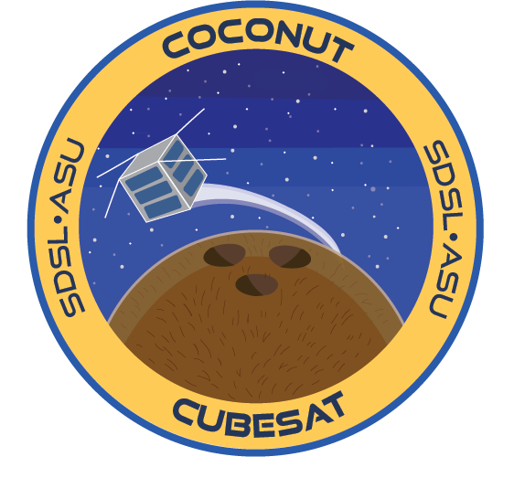

# Coconut Flight Software

This repo contains the flight software for the Arizona State University SDSL (Sun Devil Satellite Lab) Coconut CubeSat. It is designed for FreeRTOS on a Raspberry Pi Pico (RP2040). This codebase is based on [this repo](https://github.com/smittytone/RP2040-FreeRTOS), so check it out for reference.

## Building and Running
See our [Users Guide](docs/DOCS.md#usersguide) in the main documentation!

## Directory Structure
1. `main` Contains the main firmware for the satellite
2. `lib` Conatins external libraries (git submodules) used by the firmware
3. `freertos` Contains FreeRTOS configuration info
4. `scripts` Contains any testing/automation scripts unrelated to building
5. `.vscode` Contains VSCode extension configuration info and debugger setup
6. `docs` Contains markdown documents describing API functions and internal functions of certain subsystems
7. `build` Contains output from the build process (`build/Release/main/COCONUTFSW.uf2` is the main firmware output binary)