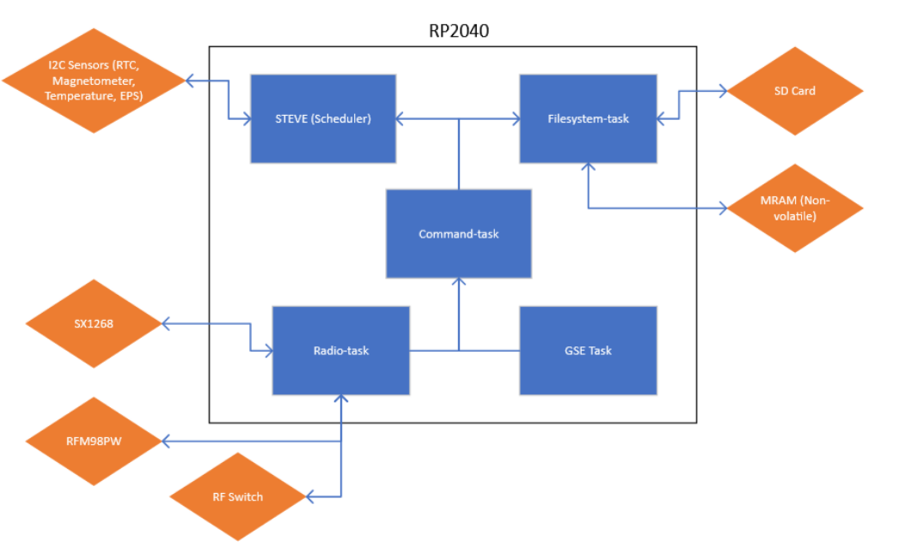
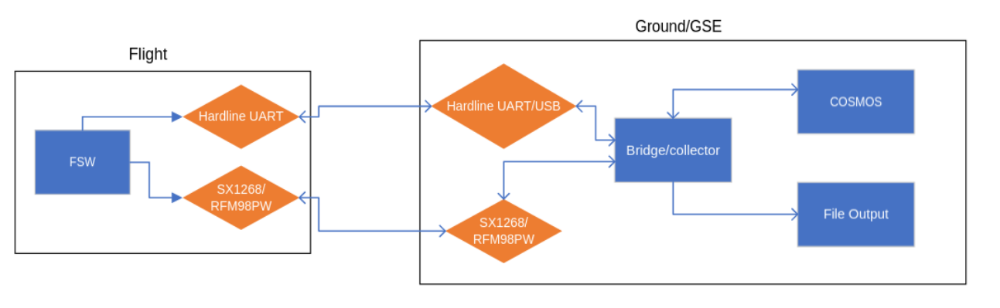

# Coconut Flight-Software

### Table of Contents

- [Coconut Flight-Software](#coconut-flight-software)
  - [Table of Contents](#table-of-contents)
  - [Introduction](#introduction)
    - [Project Origins and Goals](#project-origins-and-goals)
    - [Flight Heritage](#flight-heritage)
    - [Coconut Hardware Overview](#coconut-hardware-overview)
    - [Current Software Capabilities and Features](#current-software-capabilities-and-features)
  - [FSW Architecture Design](#fsw-architecture-design)
    - [Tools and Libraries](#tools-and-libraries)
  - [Repository Overview and Structure](#repository-overview-and-structure)
    - [Tasks/Threads Overview](#tasksthreads-overview)
  - [Users Guide](#users-guide)
    - [Setting up Dev Environment](#setting-up-dev-environment)
    - [Building and Deploying](#building-and-deploying)
    - [Debugging](#debugging)
    - [Using the Simulator](#using-the-simulator)
    - [Creating Device Drivers](#creating-device-drivers)
    - [Creating Telemetry Points](#creating-telemetry-points)
    - [Creating New STEVE Jobs](#creating-new-steve-jobs)
  - [Interacting with the Filesystem](#interacting-with-the-filesystem)

## Introduction

### Project Origins and Goals

The Coconut Flight-Software was developed for the 1U Coconut CubeSat built by the Sun Devil Satellite Lab student group in collaboration with the Interplanetary Initiative Lab at Arizona State University. The Coconut CubeSat is a 1U LoRa-based store-and-forwarding satellite. The main goal of the project was to work with educational groups to create small, inexpensive ground stations around the world that would do some kind of data collection and the Coconut CubeSat would translate that data back to ASU.
Most of the satellite was designed and built in-house by the student team using readily available parts and electrical components. The flight software resides on the main microcontroller, the RP2040 (the same chip on the Raspberry Pi Pico). See the [Coconut Hardware Overview](#coconut-hardware-overview) for more details on the flight hardware.
The goals of the Flight Software were to interact with all sensors and devices on-board Coconut's custom hardware, as well as run multiple unique tasks such as transmitting a heartbeat/beacon telemetry signal, deploy antenna elements, and store user data. A full list of capabilities are listed under the [Current Software Capabilities and Features](#current-software-capabilities-and-features) section. The #1 goal of the project is to make the software as safe and reliable as possible to minimize possibilities of failures during satellite operation.

For further questions please reach out to the Interplanetary Initiative Lab at ASU or any of our student members:
* Interplanetary Initiative Lab: iilab@asu.edu
* Dylan Larson (project lead and software engineer): dllarso4@asu.edu
* Tyler Nielsen (software subsystem team lead): tmniels3@asu.edu
* Mitchell Zakocs (honorary software subsystem team lead): mzakocs@asu.edu

### Flight Heritage

This is a growing list of projects and satellites that this flight software has flown on or will be flown on in the future.
* Coconut CubeSat - Arizona State University (Launch Q1 2026)
* SquidSat CubeSat - Arizona State University (Launch TBD)

### Coconut Hardware Overview

The Coconut Electrical hardware includes the following components/systems that the flight software interacts with:
**Flight Control Board (FCR):**
* RP2040 microcontroller: where the flight software runs
* MAX706RESA: watchdog
* 2 LoRa radios (1 for redundancy; output controlled by a switch): HopeRF RFM98PW and NiceRF LoRa1278F30
* 2 MRAM chips: 1 for storing the code instructions (FSW) and 1 for the filesystem/mission data
* Magnetometer: LIS3MDLTR
* Real-time clock: DS3231

**Electrical Power System board (EPS):**
* Battery gauge sensor: MAX17048
* Multiple INA219 sensors: current and voltage sensors
* Multiple one-wire DS18B temperature sensors

**Deployable Antenna:**
* Custom deployable antenna triggered by both I2C and GPIO (redundant controls)

### Current Software Capabilities and Features

The following list is an overview of the current features included in this repository. This list should be updated as updates are released.

Device drivers:
* MAX17048
* HopeRF and NiceRF radio interface (RadioLib is supported for other radios as well)
* LIS3MDLTR
* DS3231
* MAX17048
* INA219
* DS18B (in development)
* MAX706RESA

Capabilities:
* Task/function scheduling (run a function at a certain time with scheduling)
* CCSDS Space Packet encoding/decoding for telemetry and commands
* Sending/receiving telemetry and commands on both radio interfaces and Ground-Support Interface hard-wire interface (GSE - when you see GSE it refers to this UART hardware interface)
* Sensor data collection and telemetry packet creation for the heartbeat/beacon
* Filesystem for creating directories, files, as well as reading from files
* Command authentication (unique 8-byte token for each user)
* Simulation on Linux
* Fuzzing
* Unit testing
* Hardware and simulator debugging through gdb


## FSW Architecture Design

### Tools and Libraries

The Flight Software is built upon the C [Pico-SDK](https://www.raspberrypi.com/documentation/pico-sdk/) and FreeRTOS.
* Pico-SDK: Raspberry Pi Pico library for interfacing with the Raspberry Pi Pico hardware, such as GPIO lines, hardware communications (I2C, UART, SPI), etc.
* FreeRTOS: Real-Time Operating System that we used to allow for multiple threads (AKA tasks) to run multiple different tasks at once in the FSW

Some other libraries utilized in this repo:
* FatFS: Used to put a FatFS on the MRAM chips
* libspacepacket: custom library for CCSDS space packet processing
* RadioLib: Arduino C++ library for interfacing with many radio modules, including both of our LoRa radio modules. Uses the PicoHal.h file to convert Arduino functions to pico-sdk functions, taken from [RadioLib](https://github.com/jgromes/RadioLib/tree/master/examples/NonArduino/Pico)
* [AFLplusplus_ultimate_protobuf_mutator](https://github.com/mzakocs/AFLplusplus_ultimate_protobuf_mutator): Used to create a more effective structured input fuzzer for the flight software 

## Repository Overview and Structure

```
coconut-fsw
│   deploy.sh - builds the flight software and deploys it to an RP2040 automatically
|   docker_build.sh - build using Docker - not well tested
|   pico_sdk_import.cmake - taken from the pico-sdk
│
└───lib - contains all external libraries
│   
└───main - contains all code we wrote
│   └───drivers - all code used to interact with sensors or devices
│   └───tasks - every C file here has a function that is ran as an RTOS task/thread
|   └───utilities - any code used apart from drivers and tasks
|   └───simulator - stubbed files and functions for the simulator
|   └───test - unit tests and fuzzers
```

### Tasks/Threads Overview

Under the `main/tasks` directory, you will find multiple tasks. The `main.c` file calls each function as a task, so you can see all of the different functions running as a task. Every other C file in this directory has a function that is ran as a task by the main function. See the relative header files for API interfaces to these tasks. Physical sensor or device interactions are controlled by a single task to avoid race conditions. These tasks/threads have the following responsibilities:
* **Filesystem Task:** Initializes the filesystem on the MRAM and provides the API for interacting with the filesystem
* **GSE Task:** Handles commands and telemetry communication over the UART hardline interface (the same commands/telemetry as the radio, just a redundant hardline interface)
* **Radio Task:** Handles commands and telemetry communication over both of the radios and control of the RF switch to switch between radios
* **Command Task:** Receives raw bytes of commands from either the Radio or GSE tasks (from the ground) and parses the CCSDS header to find where to route the message to.
* **Telemetry Task:** Receives packets from any task to encapsulate in a space packet and sends to the GSE and Radio Task. This header file also includes the definitions for all telemetry packets. The "log()" functions and all variants are also transmitted over GSE only as a space packet so that both debug messages and telemetry/commands can be used over the same interface.
* **STEVE (Scheduler Task):** STEVE handles scheduling of functions (called "jobs") to execute at certain times, for instance the heartbeat/beacon executing every 30 seconds, or the antenna deployment executing 30 minutes after launch. The `jobs` directory also includes the heartbeat job, where telemetry points can be added or removed. This is executed every 30 seconds but can be changed in the `heartbeat_job.h` file.

<br>
<center>A Figure of the overall system and some of the tasks in the flight software

<br><br>
A Figure of the ground software and the radio/GSE redundancy


</center>


## Users Guide

### Setting up Dev Environment

You can choose between the following options to setup your Development Environment 

1. [Using Ubuntu (24.04) natively or using Windows WSL](using-ubuntu-or-windows-wsl)
2. [Using a Docker Container](using-a-docker-container)

#### Using Ubuntu or Windows WSL

To setup this repository, you can follow these steps:
1. Install dependencies: `sudo apt install -y python3 cmake gcc-arm-none-eabi build-essential git`
2. Clone with submodules (submodules contains all external libraries including the pic_sdk and freertos): `git clone --recurse-submodules https://github.com/ASU-SDSL/coconut-fsw`

#### Using a Docker Container

1. Ensure you have `docker` setup on your system, with docker daemon running. Ensure that you've logged into docker
2. Create a new empty folder and download only the `Dockerfile` as is from this repository and build a docker image ussing the command `docker build -t coconut-fsw .`
3. Create a container using this image by using the command `docker run --name coconut-flight-software -d -it coconut-fsw`. You'll be making use of this container for the entire development cycle. 
4. You can now use `Dev Containers` VS Code Extension to access the contents and make changes to the codebase. 
5. If you are making use of this extension, and have setup your Git on your computer using HTTPS (Not SSH), the Dev Containers extension will automatically add proper git credentialing. If not, you'd have to setup your git again in the docker container for merging your changes. 


### Building and Deploying

1. Build and deploy the firmware to the RP2040
    1. Hold the white `BOOTSEL` button on the RP2040
    2. Connect the RP2040 to your computer with Micro-USB
    3. Let go of the `BOOTSEL` button
    4. A USB flashdrive called `RPI-RP2` should connect to your computer
    5. Run `./deploy.sh` - this will also build the firmware
    6. The codebase will now be running on the board. It will boot back into the flashed firmware even if powered off and powered on again 
2. If you wish to just build and not deploy, run `./build.sh` - this will generate the `./build/` directory where you can find the uf2 executable under `./build/Debug/main/COCONUTFSW.uf2`. You can also check the contents of the scripts to find out how to build the simulator


### Debugging

For debugging, you have two options:
1. Printing to the debug log
   1. Run `ls /dev` and look for `ttyACM0` or `ttyACM1` 
   2. Run `debug/ACM0.sh` or `debug/ACM1.sh` to see the log 
   3. You will see any output from `logln_info` and `printf` calls in your code
2. Debugging through SWD/JTAG
   1. See `debug/README.md` to use the VSCode graphic debugger to set breakpoints and see variable values as your code executes

### Using the Simulator

The simulator will simulate FreeRTOS as well as many pico sdk functions, you can see the implemented pico-sdk functions and change their simulated implementations under main/simulator/pico-sdk. The filesystem is also fully functional in the simulator. You can start the simulator using the "Coconut Simulator Debug" under the VSCode debugging window.
To utilize telemetry and commands on the simulator with the host computer, the following can be done:
* In a terminal, run `socat -d -d pty,raw,echo=0 pty,raw,echo=0` - this will create 2 /dev/pts/ ports, which will route each others' inputs to the output of the other
* Once the simulator executable is built (can be done with `./deploy.sh -b -s`), you can run `./build/Simulator/main/COCONUTFSW > /dev/pts/{x} < /dev/pts/{x}` where {x} is the number of one of the ports created above
* You can then use any other program to read and write to the *other* pts port just like you would a UDP or serial port 

### Creating Device Drivers

These device drivers are not live programs/threads, but rather a small library to interface with a certain device or sensor. Every device driver has a `.h` file under `main/drivers/inc` and a `.c` file under `main/drivers/src`. Documentation for the device is to be kept in the `.h` file. Drivers are usually named after the sensor/device name or part number. Once the header and C file are complete, they can be added in the CMake compilation process doing the following:

Edit `main/CMakeLists.txt` - the `.../inc` directory is already included, so the C file is the only one that needs to be added:

```c
## Create a sources variable with a link to all cpp files to compile
set(SOURCES
    ${MAIN_DIRECTORY}/tasks/main/main.c
    ${MAIN_DIRECTORY}/tasks/gse/gse.c
    ${MAIN_DIRECTORY}/tasks/steve/steve.c
    ...
    ${MAIN_DIRECTORY}/drivers/src/your_new_sensor.c
)
```

Then the header file can be used in an `#include` anywhere throughout the FSW.

### Creating Telemetry Points

If you want to include new telemetry points/sensor values to the heartbeat/beacon packet, that can be done in the `heartbeat_job.c` and `telemetry.h` files.
Under `main/tasks/telemetry/telemetry.h`, you can add telemetry values to the `heartbeat_telemetry_t` struct:

```c
typedef struct __attribute__((__packed__)) {
    uint8_t state;
    uint32_t uptime;
    uint8_t hour;
    uint8_t minute;
    ...
    uint8_t new_sensor_value;
} heartbeat_telemetry_t;
```

Then the value of that for each beacon packet will be found/measured/calculated in the `main/tasks/steve/jobs/heartbeat_job.c` `heartbeat_telemetry_job()` function. Any invalid values or telemetry points that might return errors in their acquirement are set to max values (ex. if there is an error finding a uint8_t value, the value will be 0xff), this is to not confuse invalid values with real measurements as most telemetry values will not reach their max values. This function will also show how to utilize the telemetry task API to transmit telemetry packets and can be copied for new packets.

### Creating New STEVE Jobs

See the `main/tasks/steve/steve.h` for the API into the STEVE task, as well as the heartbeat job for reference. To add a new recurring task, follow the heartbeat job's example. Create a new h and c file for the new job under `.../jobs` with the function and implementation. Each header file for a job should have a `recurring time` and a `name` along with the function to execute. Ex:
```c
#define EXAMPLE_JOB_NAME "example_job"
#define EXAMPLE_JOB_DEFAULT_INTERVAL 5 // in seconds

void example_job(void* unused);
```

The C file will contain the implementation for the function, and the function/job can then be scheduled anywhere, but if you wish to have it execute throughout the FSW's lifetime, you can schedule it at the initialization of STEVE in `steve.c`:

```c
void initialize_steve() {
    // Initialize scheduler job mutex
    g_steve_context.mutex = xSemaphoreCreateMutex();
    // Initialize state
    g_payload_state = INIT;
    // Create jobs
    schedule_recurring_job_secs(HEARTBEAT_JOB_NAME, heartbeat_telemetry_job, HEARTBEAT_TELEMETRY_DEFAULT_INTERVAL);
    ...
    schedule_recurring_job_secs(EXAMPLE_JOB_NAME, example_job, EXAMPLE_JOB_DEFAULT_INTERVAL)
}
```

Tasks can also be removed, their interval altered, and more. See the `steve.h` header file for more info.

## Interacting with the Filesystem

See the `main/tasks/filesystem/filesystem.c` for more info on the API functions used to interact with the file system. These functions can be called by any task using the `filesystem.h` header file. There are already plenty of files that interact with the filesystem in the codebase, with `main/utilities/user_auth.c` being one of the better examples.

The filesystem interacts with the MRAM flash memory through the `main/drivers/diskio.c` device driver. This driver contains all the SPI read/write logic and should work with other SPI flash chips with some minor modifications (mainly check maximum storage size). The simulator also supports the filesystem through the use of a seperate RAM-disk device driver in `main/simulator/drivers/diskio.c`. 
